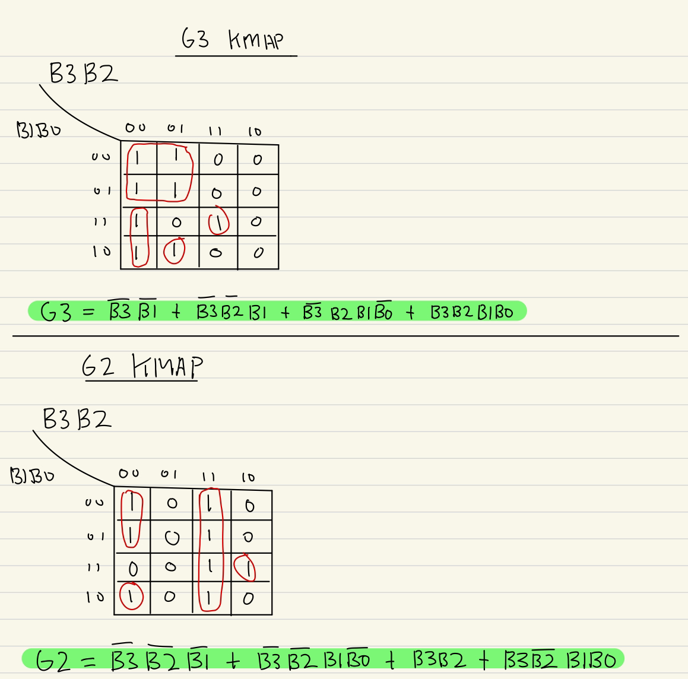
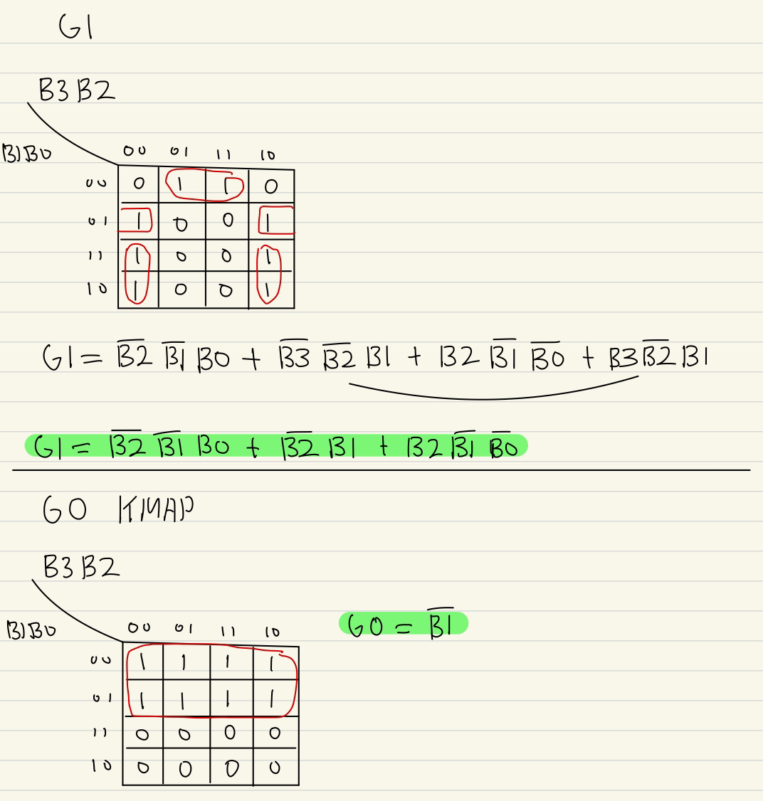
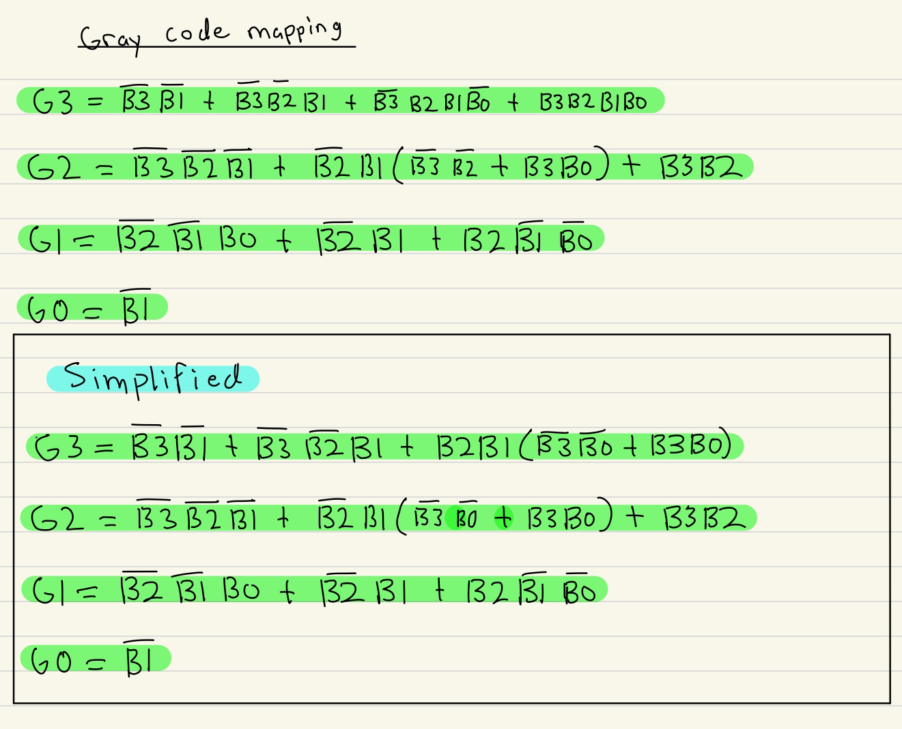

# Project 1 README

  

Student: Dunh Adam Lee (921476881)

  

## Project Status

All circuits are complete.

## Gray Code
In this part, we convert the binary input into the gray code that corresponds with the last digit of our SSID. Mine is 1 so I'll focus on column 1. We have four inputs B3, B2, B1, and B0 and we have four outputs G3, G2, G1, G0. We can find a relation between the inputs and outputs, but we don't know exactly what that relation is. 
 
To find a relation, we'll use a K-map to map every bit in the input to a bit in the output. Meaning, we will have 4 K-maps for each bit in the output to find the expressions that can convert 4-bit binary to gray code.

## Seven-Segment Display

  For the seven-segment display, the truth tables for digits 0-4 and 5-9 are the same and only differ by the Z input. So, my process was to make a truth table for digits 0-4 for only the vertical line inputs.  Once the Boolean equations for the vertical line inputs are obtained, a number from 0-4 will be displayed if Z is off or a number from 5-9 will be displayed if Z is on.
 
There is an OR gate connected to each output A-G to be able to handle multiple possible inputs.
 
### Determining display
It made sense to determine the digits in pairs since the respective digits from 0-4 and 5-9 share the same amount of vertical lines. The process:
* Use the amount of vertical lines for digits 0-4 to make a truth table for each of them. 

* Use the truth table to obtain a Boolean expression for the vertical line inputs. Digit pairs (0,5), (1,6), .., and so on, share the same vertical line Boolean expressions. Simplify the expression if possible.
* If the same expression appears multiple times, then reuse its circuit.
* For each digit pair, AND the Boolean expression for vertical lines with &not;Z if it is a digit from 0-4, or Z if the digit is 5-9, to determine which digit from the pair to display based on if Z is off or on.
*  Determine which output segments are required to display each digit by looking at what's given.
* Connect the output of each digit's circuit to the output segments required for the digit to be displayed
#### Walkthrough process for digits 0 and 5
Digits 0 and 5 have no vertical lines.
When 0 is displayed, segments [A, B, C, D, E, F] are on.
When 5 is displayed, segments [A, C, D, F, G] are on.
The vertical line inputs for 0 and 5 are expressed as this Boolean equation:  

ZERO_FIVE = \(&not; V &and; &not; W &and; &not; X &and; &not; Y)
Here, we make a NOR gate for all the vertical lines because 0 or 5 is displayed when all the vertical lines are off.
 
To determine if 0 or 5 is displayed, I used two separate AND gates to check if Z was on or off.
 
0 is displayed when Z is off and ZERO_FIVE is true, so we want to AND &not; Z with the ZERO_FIVE equation. 
 
The equation for 0 is:
ZERO = ZERO_FIVE &and; &not; Z
5 is displayed when Z is on, so we AND Z with ZERO_FIVE. 
 
The equation for 5 is: FIVE = ZERO_FIVE &and;  Z
 
The following digit pairs: (1,6), (2,7), (3,8), (4,9) follow the same process as above. 
